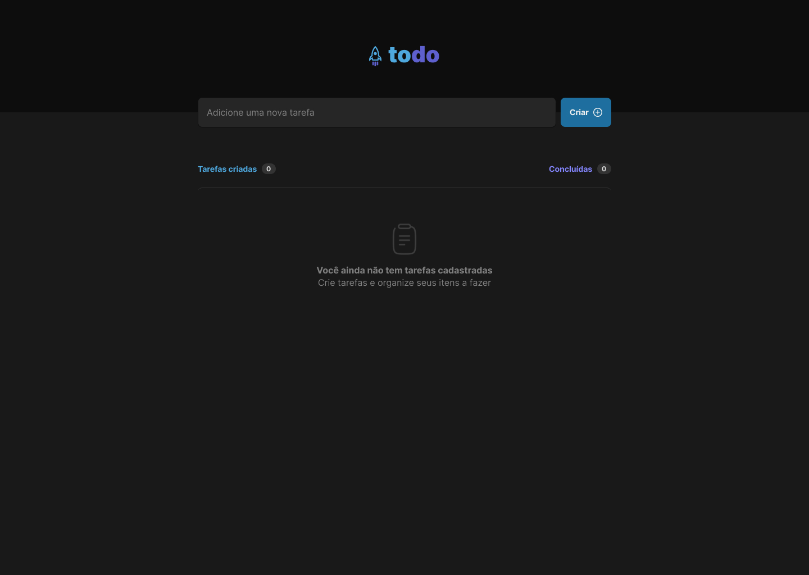

<h1 align="center">
    
</h1>

<h1>
    
</h1>

# Indice

- [Indice](#indice)
  - [🔖&nbsp; Sobre](#-sobre)
  - [🚀 Tecnologias utilizadas](#-tecnologias-utilizadas)
  - [🗂 Como baixar o projeto](#-como-baixar-o-projeto)

## 🔖&nbsp; Sobre

O projeto TODO é um gerenciador de tarefas que foi desenvolvido com ReactJS e Typescript.

---

## 🚀 Tecnologias utilizadas

O projeto foi desenvolvido utilizando as seguintes tecnologias

- [ReactJS](https://reactjs.org)
- [Typescript](https://www.typescriptlang.org/)
- [Phosphoricons](https://phosphoricons.com/)

---

## 🗂 Como baixar o projeto

```bash

    # Clonar o repositório
    $ git clone https://github.com/rogerioopaiva/react-todo-list-ts

    # Entrar no diretório
    $ cd react-todo-list-ts

    # Instalar as dependências
    $ npm install

    # Iniciar o projeto
    $ npm run dev
```

---

<p align="center">Desenvolvido  por Rogerio Paiva</p>